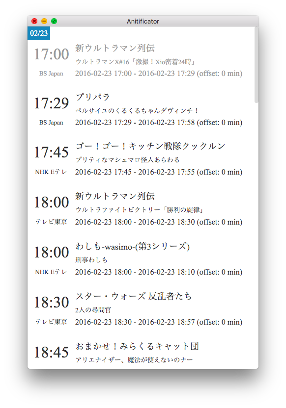
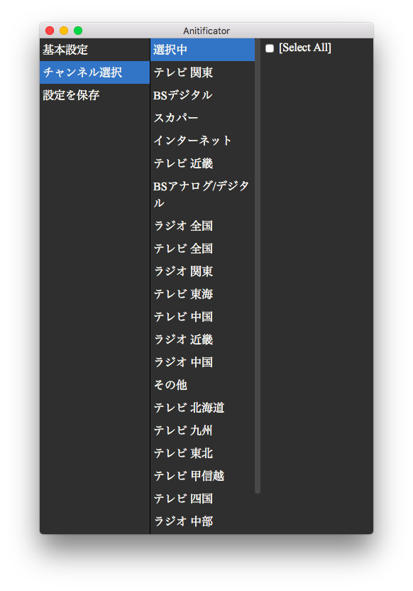
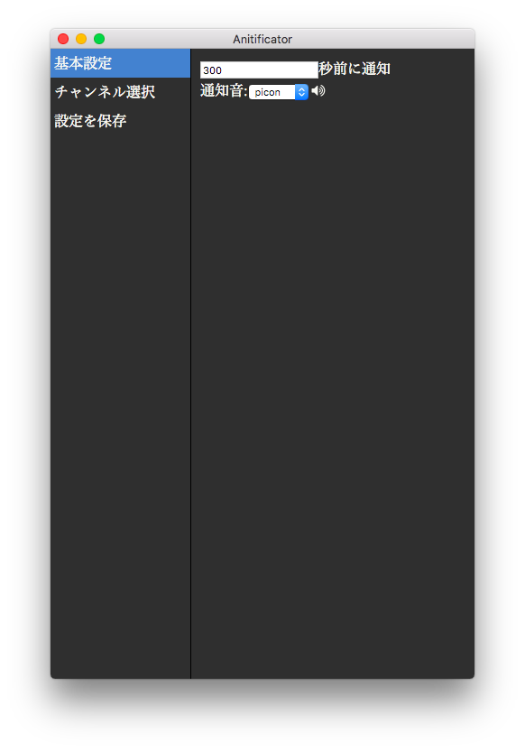

# Anitificator


Anitificator はアニメの開始時間（のちょっと前）に通知してくれるアプリケーションです。  
これを使えば、PCでの作業が白熱していても、見たい番組を見逃さずに済むかもしれません。  
画面は以下のような感じになるので、簡易的なアニメ番組表としても使用可能です。



現在は問答無用でこのディスプレイが常駐しますが、基本的にこのアプリケーションの主目的は通知ですので、将来的にはメニューバー + Optional でウインドウというスタイルにするつもりです。

## 使い方

初回起動時は以下のような画面が表示されるので、自身が視聴可能なチャンネルを選択してください。  



[設定を保存]で選択したチャンネルの番組表が表示されます。

現状、番組表に表示されているすべての番組が通知されます。これは後々変更すると思います。  


また、[基本設定]のタブで通知音の変更、何分前に通知するか（default: 300秒(= 5分)）の設定が可能です。



設定が完了したら、[設定を保存]を押してください。

これらの設定はメニューバーの[Anitificator]→[Preferences...] からいつでも変更可能です。  

## クレジット
Anitificator は Electron + React を使って作っています。  
バグ報告は Issues かまるまるに投げていただければ対応するかもしれません。

番組表情報は、[しょぼいカレンダー](http://cal.syoboi.jp/)のapiを利用させていただいています。

通知音はshireさん([twitter](http://twitter.com/shire001)) に製作してもらいました。ありがたいです。


## 開発者の方へ
forkしてcloneした後、
``` sh
npm install
gulp
```
で Live reload で開発できるはずです。  
依存関係そんなないと思いますが、足りないものは適宜。
